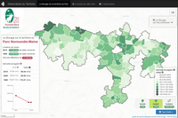
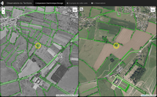

# Bd-Bocage-Outils
Partage d'outils autours de la valorisation des bases de données de haies (Bd Bocage) des PNR Normands

## Interfaces Bocage PNR Normandie-Maine

Les "développements" sont basés sur Leaflet + PostGis

2 interfaces sont mises à dispositions : 1 statistique et 1 diachronique (navigation synchronisée)

### Interface statistique

Fichier PHP principal : [lien](interfaces/bocage.php)

L'interface statistique interroge la base de données PostGis en créant des GeoJson basés sur des Vues Matérialisées (VM), ceci à différentes échelles d'analyse.

Demo : http://observatoire.parc-naturel-normandie-maine.fr/bocage.php

### Interface diachronique

Fichier PHP principal : [lien](interfaces/bocage_diachronique.php)

L'interface diachronique affiche la Bd-Bocage depuis les flux WMS générés par Carmen.

Le plugin [Leaflet.Sync](https://github.com/jieter/Leaflet.Sync) est utilisé pour synchroniser la navigation entre les 2 cartes.

Demo : http://observatoire.parc-naturel-normandie-maine.fr/bocage_diachronique.php

## Interfaces Bocage PNR du Perche

Les applications sont basées sur les outils ArcGis Online d'ESRI.

**Profil du bocage des communes du Parc naturel régional du Perche :**

http://pnrp.maps.arcgis.com/apps/PublicInformation/index.html?appid=681f56f994324bb388231b8384957716

**L'évolution du Bocage Percheron de 1947 à 2010 :**

http://pnrp.maps.arcgis.com/apps/StorytellingSwipe/index.html?appid=ae741311d0244ad39e3b1f56a643adc9

